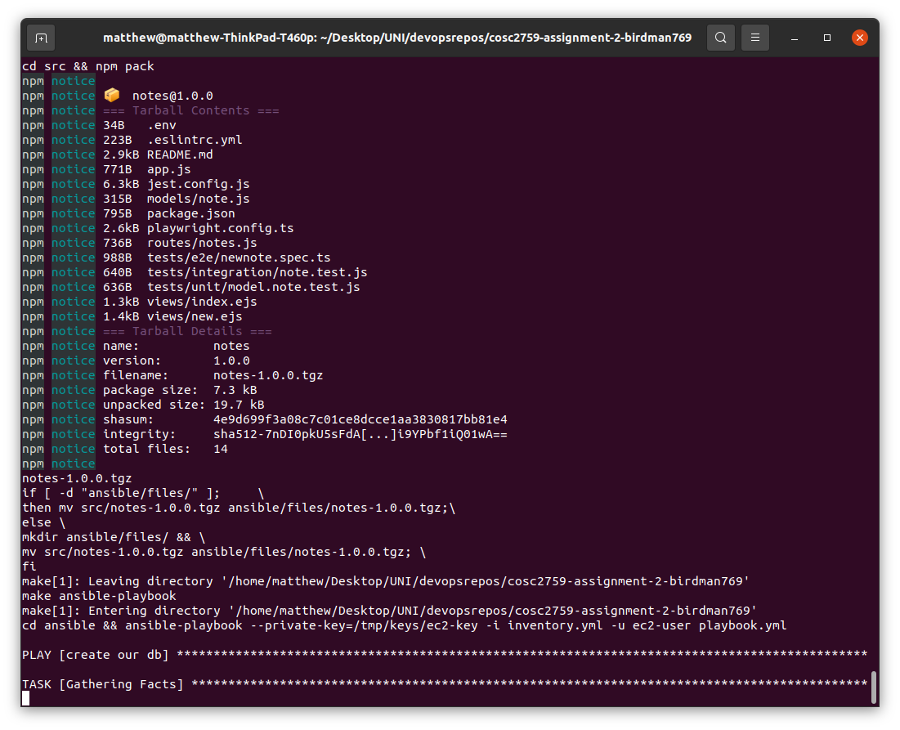

# COSC2759 Assignment 2
## Notes App - CD
- Full Name: Matthew Bird
- Student ID: S3482450

https://github.com/rmit-computing-technologies/cosc2759-assignment-2-birdman769

# 2. RUNNING THE APPLICATION- FIRST TIME

# 2.1 TO RUN

update aws credentials in ~/.aws

run these commands from root: 

> make bootstrap   

(or comment out the  backend in main.tf)

then:

> make all-up-fresh

please note, sometimes an error is thrown because a reasource is not ready but terraform thinks it is. Just run it again if this happens.

manually approve ssh fingerprint.

# 2.2 steps used in TO RUN above

This command above runs the following other make commands in the correct order and is intended for a first time run: 

> make ssh-gen

generates a key to a tmp directory for ssh authentication with Ec2 instances

> make infra-init

initilise terraform

> make infra-plan

create the terraform plan

> make infra-up

apply the terraform plan and gerate our could infastructure 

> make ansible-get-ips

this gets the IP's of our Ec2 instances and places them inside out inventory.yml file
it also then gets the IP of the db instance and configures the src/.env with the correct server address for the mongodb# 2.2 ansible playbook - db instance

packs our application up for transfer to web application

> make ansible-playbook

see below: 

# 2.3 ansible playbook - db instance

The ansible playbook first configures the db ec2 instance
its tasks are to (in order):

1. task 1: update the machine 

2. task 2: add the repo for mongodb

3. task 3: install the mongodb 

4. task 4: enable the mongodb to run on boot

5. task 5: update the mongod.conf file. This file has to be configured to allow the appropriate addresses. This is done by copying a preconfigured mongod.conf file from our local machine over the existing mongod.conf file on the EC2 db instance. 

6. task 6: after the conf file is changed, mongod will have to be restarted. the next task restarts mongo. 

# 2.4 ansible playbook - web instance

1. task 1 and two clear out any pre existing files. Each time Ec2 instances are launched their public IP changes- as such the IP's configured in the packages on a previously configured web instance need to be removed as they are invalid. Otherwise ansible will think these existing packages are OK for the next job. Where as we want a fresh install from scratch. See comments above these jobs in playbook for more details. It is expected that these will throw errors if the files are not there (fresh install). Hence why they are ignored. 

2. Task 3 copies the notes.tgz package over to the ec2 web machine

3. Task 4: creates a /webapp directory where we will unpack our application to

4. Task 5: unzips our .tgz to the web app directory

5. Task 6: updates the machine

6. task 7: add the repo link for node

7. Task 8: installs node 

8. task 9: configures node to the correct version of node (the required version listed in the readme of the webapp)

9. Task 10: run npm install in the package folder (as per the webapp readme instructions)

10. Task 11: clears the port the application is running on. I commented this out for now as it is not needed, but in a larger scale deployment it makes a nice bug prevention feature. 

11. Task 12: run our web app. At the moment your asible playbook output will sit here as the web app is running. I haven't figured out yet how to exit the playbook but keep the web app running yet. 

However the web app will now be accesssible on the public ip address. Without closing the playbook, in a seperate terminal in the root directory user: 

> make infra-get-web-output

and paste this into your browser, or copy one of the many IP outputs on the playbook. Access using HTTP.

otherwise, if you have run the prior command at least once (and not run make infra-destroy), you can simply run:

>make all-up

this will get new IPs, make a new package, remove the existing web app and install a fresh webapp. 

# 3.1 LIMITATIONS OF SINGLE EC2 DATABASE

The first and foremost limitation of using a single ec2 machine as our database is the availability and integregity. If the single ec2 instance experiences a problem and crashes, access to the database will be completely lost. This also means that if we lose the Ec2 instance completely- either through a fault or accidental termination, we could easily also lose the data stored in the Ec2 database permenantly. 

Another issue is scalability. If we were to deploy a large scale web application that can have multiple web instances that all communicate with the single db instance, this will slow down the applications or stop their database access completely depending on the amount of requests to the database. 

Another issue is administration/maintenance. A database running on an Ec2 instance requires a more hands on approach to maintenance. 

## 3.2 alternatives

The first alternative is Amazon DynamoDB. DynamoDB is a NoSQL database that provides high speed and scalability. It is a key-value database, perfect for out notes application. This however requires recoguring our application to work with DynamoDb.

The second alternative is Amazon DocumentDB. Amazon DocumentDB is a large scale mongodb compatible database service. It automates a lot of the tasks surrounding self managing a mongodb database and can support extremely large scale. 

# 4. Screenshot demos (make all-up-fresh):

Below is a series of images showing the result of running make all-up-fresh:

make-all-up-fresh being run:

ssh generation:

terraform initilizing: 

terraform planning: 

terraform outputs:

terraform creating our infastructure: 

terraform creating our infastructure: 

terraform apply completing: 

terraform updating our IP addresses in relavant locations and configing env: 

npm packing artefact: 

playbook configuring database ec2 instance: 

playbook configuring web ec2 instance: 

our web application on its public IP address

creating a new note on the web app

our new note on the web app:

terminating our web app and running make infra-down

terraform destroying our infastructure: 

terraform destroy success: 

